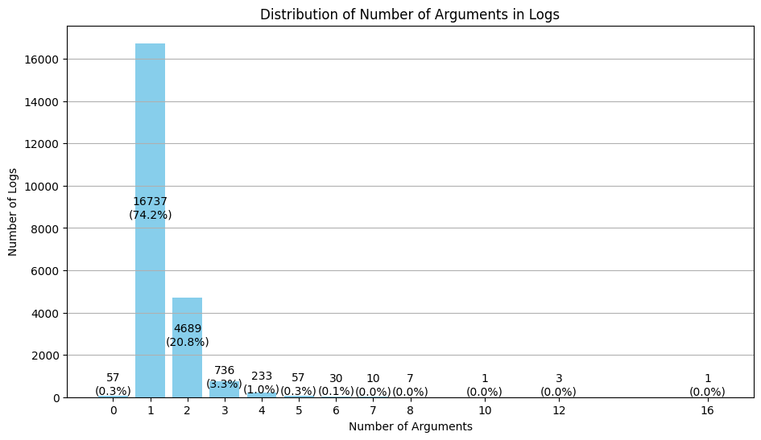
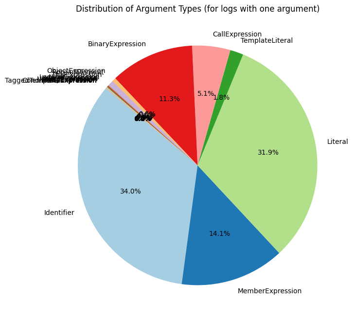
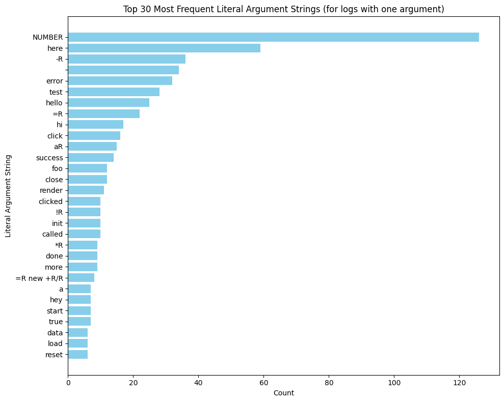
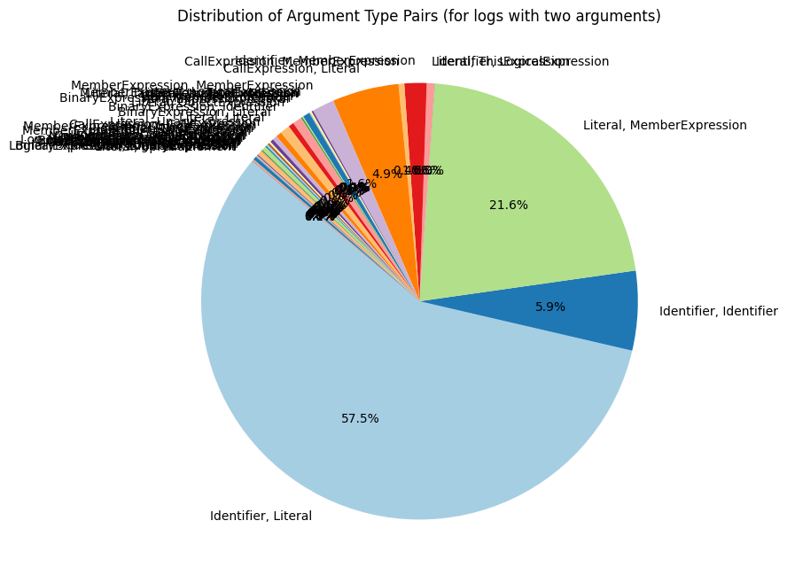
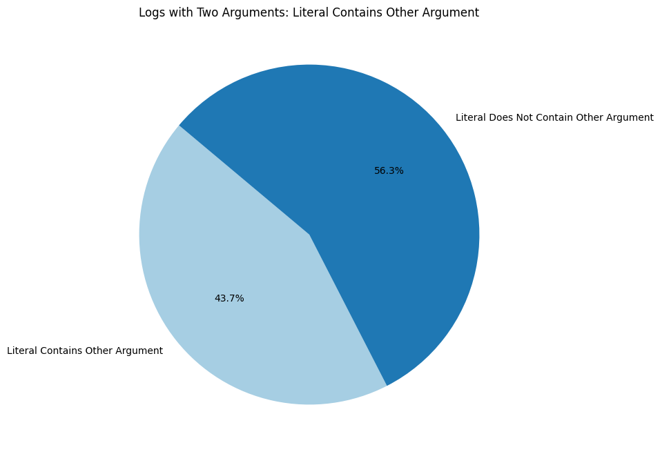

## Uncovering the Dirt on Ad-hoc Logs

Yi-Hung Chou

---

<section>
  <h3>What are the ad-hoc logs, and why should we understand them?<h3>
</section>
<section>
  Instead of consulting debuggers first, previous research showed that developers <b>heavily relied on the print statements when debugging</b> 
  
  Beller et al. 2018, Perscheid et al. 2014, and Siegmund et al. 2014
</section>
<section>
  Some prior studies have extensively focused on understanding the characteristics of log statements and debugging behaviors through observational studies or mining the existing repositories.

  Chen & Jiang 2021, Fu et al. 2024
</section>
<section>
  Most of them focusing on understanding the logs that kept in the production code, while none of them focusing on understanding the ephemeral log statements or, <b>Ad-Hoc Logs</b>.
</section>

---

<section>
  <div class="r-stack">
    <h2 class="fragment fade-out" data-fragment-index="0">How can we find these logs that exists only a short time?</h2>
    <h1 class="fragment r-fit" data-fragment-index="1">Through Developers' Mistakes!</p>
  </div>
</section>
<section>
  <div class="r-stack">
    <p class="fragment fade-out" data-fragment-index="0">Developers often accidentally pushed the code with console.logs that used for debugging and remove them later with another commit.</p>
  </div>
</section>

---

<section>
  <div class="r-stack">
  <div class="fragment fade-out" data-fragment-index="0">
    <p>By searching commit messages,<br/> such as "delete console.log" or "remove console.log",<p>

```sql
  FROM
    `bigquery-public-data.github_repos.commits`
  WHERE message LIKE '%delete%console.log%' 
    OR message LIKE '%remove%console.log%'
```
  <p>we found 1.6GB of commits and diff files from GitHub Archive in Google BigQuery<p>
  </div>

  <div class="fragment fade-in-then-out" data-fragment-index="1">
    <p>By filtering out commits with parsing errors <br/> (16,590 to 13,694), and commits without deleting logs<p>
    
    <p>we found 10,598 commits that actually contains removed logs<p>
  </div>
  <div class="fragment" data-fragment-index="2">
    <p>The data spans from 2007 to 2022<p>
    
    <p>with mu=126.7 logs, mu=89.2 commits per month, and mu=1.65 commits, mu=2.72 per repo<p>
  </div>
</section>

---

## What are these repositories?

Mostly personal projects, small size, and with less than 10 contributors.


---

### Where do developers put their logs?

Near half of them are put into callback or asynchronous functions, where the program flow might not be easily controlled.


---

#### What do developers put into their logs?

<div class="r-stack">
  <div class="fragment fade-out" data-fragment-index="0">
    <p>Most of the logs contains only 1 parameter (74.2%) <p>
    
  </div>
  <div class="fragment fade-in-then-out" data-fragment-index="1">
    <p>Most of the arguments developers put into ad-hoc logs are literals or identifiers<p>
    
  </div>
  <div class="fragment fade-in-then-out" data-fragment-index="2">
    <p>Among the literals, many of them are <br/> template strings (e.g., ======) or <br/> log locators (e.g., number or here) <p>
    
  </div>
  <div class="fragment fade-in-then-out" data-fragment-index="3">
      <p>When there are two arguments,<br/> most combinations involve a literal and an identifier,<br/> such as console.log("response is:", response).</p>
      
  </div>
  <div class="fragment" data-fragment-index="4">
      <p>To investigate how many of these combinations involve a string labeling the identifier, <br/> we created a pie chart to show how often the literals contain the identifiers name.</p>
      
  </div>
</div>

---

# Questions?
