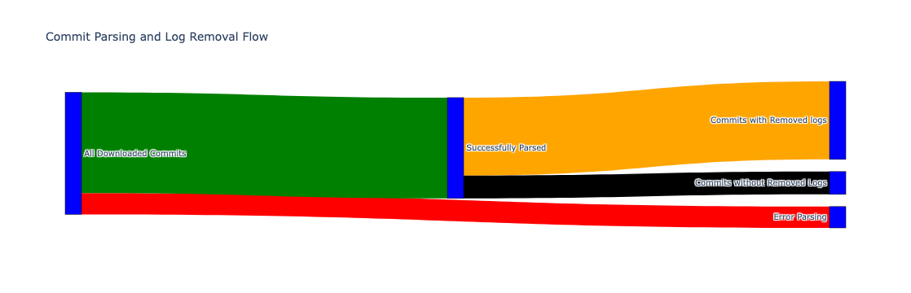
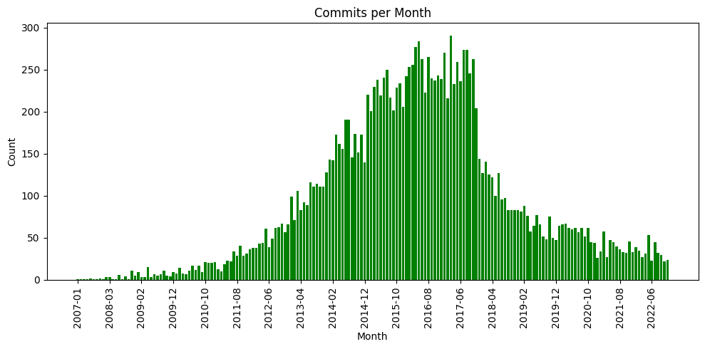
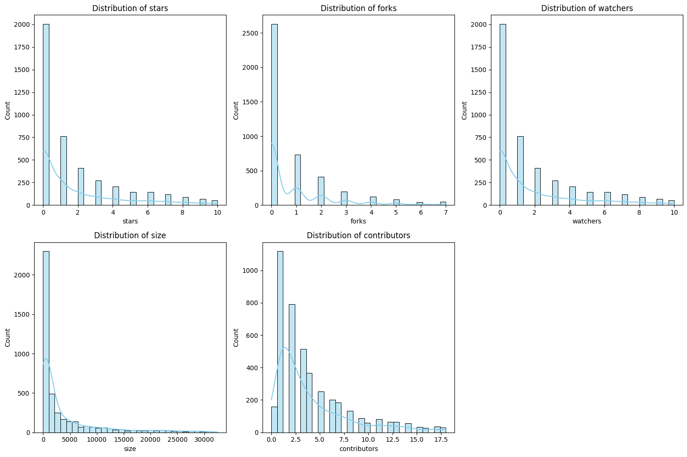
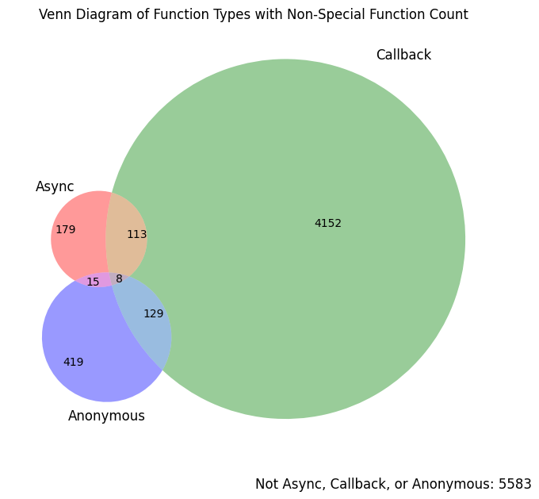

## Uncovering the Dirt on Ad-hoc Logs

Yi-Hung Chou

---

<section>
  <h3>What are the ad-hoc logs, and why should we understand them?<h3>
</section>
<section>
  Instead of consulting debuggers first, previous research showed that developers <b>heavily relied on the print statements when debugging</b> 
  
  Beller et al. 2018, Perscheid et al. 2014, and Siegmund et al. 2014
</section>
<section>
  Some prior studies have extensively focused on understanding the characteristics of log statements and debugging behaviors through observational studies or mining the existing repositories.

  Chen & Jiang 2021, Fu et al. 2024
</section>
<section>
  Most of them focusing on understanding the logs that kept in the production code, while none of them focusing on understanding the ephemeral log statements or, <b>Ad-Hoc Logs</b>.
</section>

---

<section>
  <div class="r-stack">
    <h2 class="fragment fade-out" data-fragment-index="0">How can we find these logs that exists only a short time?</h2>
    <h1 class="fragment r-fit" data-fragment-index="1">Through Developers' Mistakes!</p>
  </div>
</section>
<section>
  <div class="r-stack">
    <p class="fragment fade-out" data-fragment-index="0">Developers often accidentally pushed the code with console.logs that used for debugging and remove them later with another commit.</p>
  </div>
</section>

---

<section>
  <div class="r-stack">
  <div class="fragment fade-out" data-fragment-index="0">
    <p>By searching commit messages,<br/> such as "delete console.log" or "remove console.log",<p>

```sql
  FROM
    `bigquery-public-data.github_repos.commits`
  WHERE message LIKE '%delete%console.log%' 
    OR message LIKE '%remove%console.log%'
```
  <p>we found 1.6GB of commits and diff files from GitHub Archive in Google BigQuery<p>
  </div>

  <div class="fragment fade-in-then-out" data-fragment-index="1">
    <p>By filtering out commits with parsing errors <br/> (16,590 to 13,694), and commits without deleting logs<p>
    
    <p>we found 10,598 commits that actually contains removed logs<p>
  </div>
  <div class="fragment" data-fragment-index="2">
    <p>The data spans from 2007 to 2022<p>
    
    <p>with mu=126.7 logs, mu=89.2 commits per month, and mu=1.65 commits, mu=2.72 per repo<p>
  </div>
</section>

---

## What are these repositories?

Mostly personal projects, small size, and with less than 10 contributors.



---

### Where do developers put their logs?

Near half of them are put into callback or asynchronous functions, where the program flow might not be easily controlled.



---
<!-- 
## Fragments

Make content appear incrementally

```
{} One {}
{} **Two** {}
{} Three {}
```

Press `Space` to play!

{} One {}
{} **Two** {}
{} Three {}

---

A fragment can accept two optional parameters:

- `class`: use a custom style (requires definition in custom CSS)
- `weight`: sets the order in which a fragment appears

---

## Speaker Notes

Add speaker notes to your presentation

```markdown
{}

- Only the speaker can read these notes
- Press `S` key to view
  {}
```

Press the `S` key to view the speaker notes!



- Only the speaker can read these notes
- Press `S` key to view
  

---

## Themes

- black: Black background, white text, blue links (default)
- white: White background, black text, blue links
- league: Gray background, white text, blue links
- beige: Beige background, dark text, brown links
- sky: Blue background, thin dark text, blue links

---

- night: Black background, thick white text, orange links
- serif: Cappuccino background, gray text, brown links
- simple: White background, black text, blue links
- solarized: Cream-colored background, dark green text, blue links

---



## Custom Slide

Customize the slide style and background

```markdown



```

---

## Custom CSS Example

Let's make headers navy colored.

Create `assets/css/reveal_custom.css` with:

```css
.reveal section h1,
.reveal section h2,
.reveal section h3 {
  color: navy;
}
```

--- -->

# Questions?

[Ask](https://discord.gg/z8wNYzb)

[Documentation](https://wowchemy.com/docs/content/slides/)
